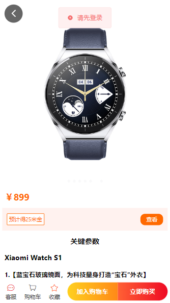
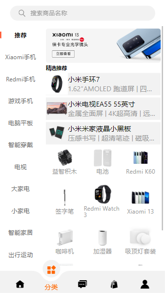

# vue3-shop

基于Vue3 + Vite框架 + TypeScript + Vant + Babel 创建的移动购物商城。

## Project Setup

```sh
npm install
```

### Compile and Hot-Reload for Development

```sh
npm run dev
```

### Type-Check, Compile and Minify for Production

```sh
npm run build
```
### 展示


